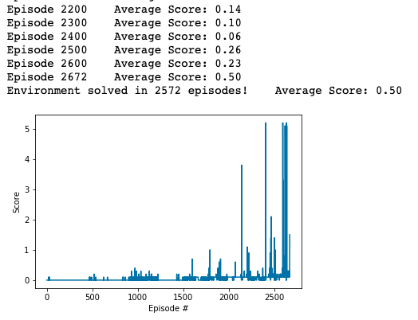

# P3 Continuous Control Report

In this project, we trained a pair of agents (via a DDPG) to play a game of friendly tennis.

## Learning Algorithm

The general RL algorithm that is used is a **Deep Deterministic Policy Gradient (DDPG)**. 

### The DDPG

The DDPG is an agent that contains two functions. One is called the **critic**, which is a function (which is represented as a neural network) which takes the state S + action A and outputs the expected reward for taking each action given a state, and thus the outputs are equivalent to Q(S, A). The other function is called the **actor**, which is a function a(S) which takes in a state and outputs a best action.

### Actor Architecture

The actor architecture is a simple feed-forward neural network (FFNN) with 4 hidden layers:
* Input Layer: 33 inputs (values in the state vector)
* Hidden Layer 1: 128 neurons
* Hidden Layer 2: 64 neurons
* Hidden Layer 3: 32 neurons
* Hidden Layer 4: 16 neurons
* Output Layer: 4 outputs (action vectors)

ReLU activation functions were used except for the last activation function that produced the output, which is the tanh activation function. This function ensures that the action vector has values between -1 and 1.

### Critic Architecture

The critic architecture is a simple feed-forward neural network (FFNN) with 4 hidden layers:
* Input Layer: 37 inputs (values in the state vector)
* Hidden Layer 1: 128 neurons
* Hidden Layer 2: 64 neurons
* Hidden Layer 3: 32 neurons
* Hidden Layer 4: 16 neurons
* Output Layer: 1 output (expected reward)

ReLU activation functions were used.

### Replay Buffer

In order to store experiences (S, A, R, S') for later training of the DDPG, a replay buffer (with a certain size) is used. Each new experience is added to the replay buffer until there is enough to train on a batch of data.

## Multi-Agent Considerations

Given that each agent receives its own, local observation, this simplifies the problem a lot. We can now use the same actor network, critic network, and replay buffer for both agents.

## Hyperparameters

Here are the hyperparameters that are used in this implementation:

### Actor Network

| Parameter   | Type  | Value | Description |
| ----------- | ----- | ----- | -- |
| actor_fc1_units   | int   | 128   | Number of neurons in the first hidden layer |
| actor_fc2_units   | int   | 64    | Number of neurons in the second hidden layer |
| actor_fc3_units   | int   | 32    | Number of neurons in the second hidden layer |
| actor_fc4_units   | int   | 16    | Number of neurons in the second hidden layer |

### Critic Network

| Parameter   | Type  | Value | Description |
| ----------- | ----- | ----- | -- |
| critic_fc1_units   | int   | 128   | Number of neurons in the first hidden layer |
| critic_fc2_units   | int   | 64    | Number of neurons in the second hidden layer |
| critic_fc3_units   | int   | 32    | Number of neurons in the second hidden layer |
| critic_fc4_units   | int   | 16    | Number of neurons in the second hidden layer |

### Replay Buffer

| Parameter   | Type  | Value  | Description |
| ----------- | ----- | -----  | -- |
| buffer_size | int   | 1e5    | Maximum size of buffer |
| batch_size  | int   | 32     | Size of each training batch |

### OU Noise

| Parameter   | Type  | Value  | Description |
| ----------- | ----- | -----  | -- |
| theta       | float | 0.15   | Friction for deviating from the mean |
| sigma       | float | 0.05   | Noise level (gaussian) |

### DDPG Agent

| Parameter   | Type  | Value  | Description |
| ----------- | ----- | -----  | -- |
| buffer_size | int   | 1e5    | Maximum size of buffer |
| batch_size  | int   | 32    | Size of each training batch |
| actor_lr    | float | 7e-4   | Learning rate of the DDPG Actor |
| critic_lr   | float | 8e-4   | Learning rate of the DDPG Critic |
| gamma        | float | 0.95  | reward discount factor |
| tau          | float | 1e-3  | constant for soft update of target network |

### DDPG Training

| Parameter    | Type  | Value   | Description |
| ------------ | ----- | ------- | -- |
| n_episodes   | int   | 10000   | Maximum number of DDPG training episodes (could be less if the environment is already solved) |
| max_t        | int   | 1000    | maximum number of timesteps per episode |

## Plot of Rewards

Here is a plot of the rewards received by an agent during DDPG training over time:

## Ideas for Future Work

Many of these ideas for future work will be centered around training the DDPG agent more efficiently.

* **Use a Smaller Neural Network**: A smaller neural network architecture will result in faster training of a DDPG, and there are more efficient neural network architecture for Actor and Critic than one that uses fewer hidden layers than 4 (which means significantly fewer model parameters to tweak).

* **Use Adaptive Learning Rate and Noise**: When training the DDPG agent (especially given the unstable nature of multi-agent training) the performances of actor and critic fluctuate without much clear progress in the first 1000 episodes (staying mostly at the +0.01 reward threshold). Then, once the 2000th training episode is reached, the reward change accelerates at a much more rapid pace. If we had a dynamic learning rate that could increase around the 2000th episode (or whenever the average reward starts to accelerate), then we could get to +0.5 with much fewer episodes and potentially reach farther reward heights than with a smaller learning rate. A similar idea would work for the noise (OU noise), as we would start off with a larger noise but then decreasing the noise as the agent gets better and better.

* **Add Prioritized Experience Replay**: This is where experiences in the replay buffer are weighted based on how much the model is expected to learn from the example in the future. By using this technique, we can speed up training by updating the model with a higher intensity where it really matters. This may also help counter a little bit of the instability in multi-agent training.